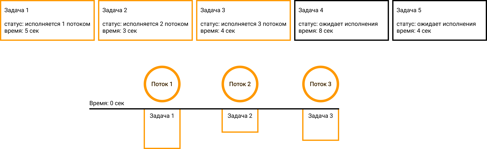
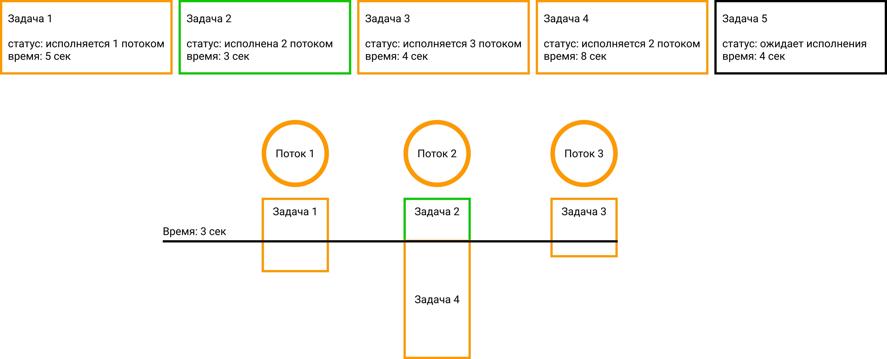
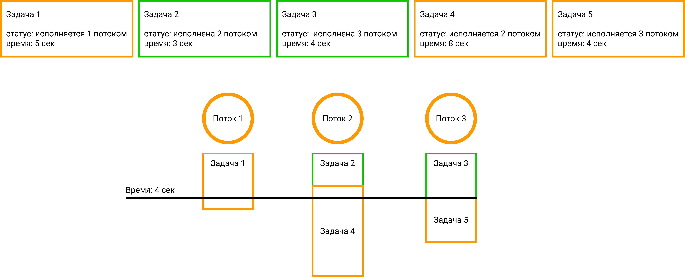
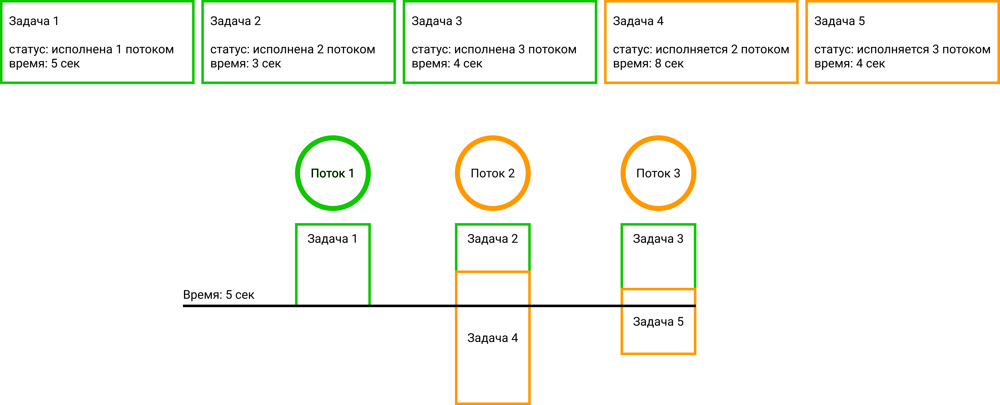
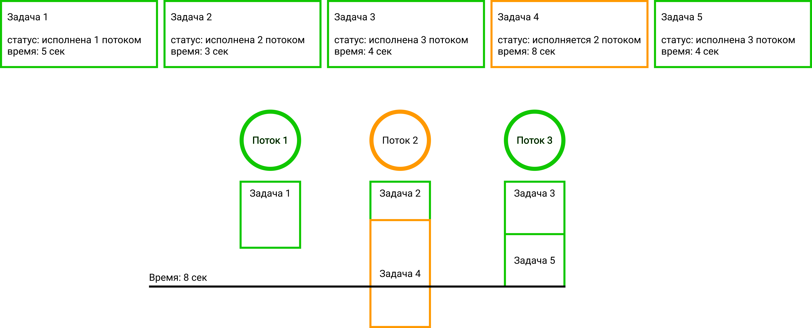
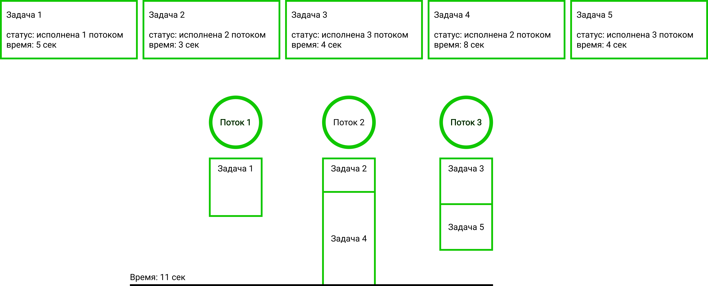

# Кто такой Thread Pool и как его написать своими руками на С++

## Для кого статья?

Статья будет полезна всем, кто хочет разобраться с работой Thread Pool раз и на всегда или же никогда о нём не слышал.

## Что нового я могу узнать из статьи?

* Кто такой Thread Pool?
* Зачем использовать Thread Pool?
* Логика работы Thread Pool
* [Реализация](./basic_version.cpp) C++ 14
* [Реализация](./best_version.cpp) C++ 17
* Сравнение реализаций

## Кто такой Thread Pool?

Это удобный в использовании паттерн, позволяющая выполнять множество задач используя ресурсы множества потоков. Thread Pool состоит обычно из очереди задач и нескольких потоках, которые достают задачи из очереди и выполняют их параллельно

## Зачем использовать Thread Pool?

* Помогает увеличить производительность программы благодаря созданию потоков один раз (создание потока считается достаточно тяжёлой операцией)
* Предоставляет удобный интерфейс для работы с многопоточностью, который понятен человеку не знакомому с многопоточностью

## Немного цифр

Протестировав 3 случая: запуск без потоков, с созданием потоков через std::thread и с использованием thread_pool. На программе:

```
void test_func(int& res, const std::vector<int>& arr) {
    res = 0;
    for (int i = arr.size() - 1; i >= 0; --i) {
        for (int j = 0; j < arr.size(); ++j) {
            res += arr[i] + arr[j];
        }
    }
}
```

Получились следующие результаты:

| Способ запуска               | Время (миллисекунды) | Кол-во потоков |
|------------------------------|----------------------|----------------|
| Без потоков                  | 83954                | 1              |
| С использованием std::thred  | 62386                | 6              |
| С использованием thread_pool | 52474                | 6              |

Стоит отметить, что у меня на компьютере можно создать максимум 8 потоков и запускался тестовый пример в Visual Studio на платформе Windows. Это значит, что фоновая работа сторонних приложений может создавать флуктуации и при каждом запуске мы будем получать разные времена. Код примеров можно посмотреть [ТУТ](./basic_version.cpp) функция `run_test`

## Почему 6 потоков не ускорили код в 6 раз? (ДОПИСАТЬ)

системные прирывания, закон Амдала, возможное вмешательство других приложений

## Хорошо, но тогда как Thread Pool работает?

Thread Pool имеет очередь задач из которой каждый поток достаёт новую задачу при условии, что очередь не пуста и поток свободен. Для более детального описания давайте рассмотрим работу Thread Pool на примере


<b>Начальная стадия:</b> все потоки свободны, а в очереди присутствует 5 задач



<b>Стадия 1:</b> Каждый из потоков взял задачу на исполнение, при этом на практике первый поток не обязательно берёт первую задачу, это зависит от того, кто первый получит доступ к общему ресурсу - очереди (ПОЧЕМУ?). В очереди остались только 4 и 5 задача (чёрным цветом обозначены задачи, которые остались в очереди)



<b>Стадия 2:</b> На 3 секунде второй поток завершает выполнение 2 задачи и берёт первую свободную задачу из очереди (4 задачу). В очереди остаётся только 5 задача



<b>Стадия 3:</b> Третий поток завершил задачу 3 и взял последнюю задачу из очереди (5 задачу). Очередь стала пустой, но наша программа не должна завершать работу, сначала следует дождаться выполнения всех задач



<b>Стадия 4:</b> Первый поток завершил выполнение своей задачи и не берёт новых задач (т. к. очередь пуста). Может показаться, что если у нас нет задачи, когда мы закончили, то следующие задачи поток уже не выполняет. На самом деле это не так и как только придёт новая задача, свободный поток сразу начнёт её исполнение.



<b>Стадия 5:</b> Третий поток закончил выполнять задачу 5



<b>Стадия 6:</b> Второй поток закончил исполнение 4 задачи. 

<b>Итог:</b> Thread Pool выполнил 5 задач за 11 секунд.

## Что будет уметь делать наш Thread Pool?

Мы уже разобрались с общим механизмом работы Thread Pool, теперь подумаем о его функциональности.

В нашем Thread Pool будет 2 типа задач: `блокирующие` (будут тормозить основной поток до тех пор, пока команда не будет исполнена) и `не блокирующие` (гарантированно исполняются очень быстро и не тормозят основной поток)

Thread Pool будет иметь следующий интерфейс:

* `init(num_threads)` - метод, создающий массив из num_threads потоков. В нашей реализации в качестве данного метода будет выступать конструктор.
* `add_task(task_func, args)` - не блокирующий метод добавления новой задачи. Принимает функцию task_func и аргументы данной функции args и возвращает task_id (уникальный номер задачи).
* `wait(task_id)` - блокирующий метод, ожидающий выполнения задачи с указанным task_id. В данной реализации мы не будем сохранять результат работы функции, при этом функция обязательно должна возвращать void.
* `wait_all()` - блокирующий метод, дожидающийся завершения всех задач.
* `calculated(task_id)` - не блокирующий метод, проверяющий была ли выполнена задача с номером task_id.
* `shotdown()` - блокирующий метод, дожидающийся завершения всех задач и завершающий работу Thread Pool. Для корректного завершения работы программы будем использовать деструктор (хотя можно дополнительно добавить и метод).

## Реализация базовой версии (C++ 14)

Рассмотрим переменные, которые будут использоваться в нашем классе

```
// очередь задач - хранит функцию(задачу), которую нужно исполнить и номер задачи
std::queue<std::pair<std::future<void>, int64_t>> q; 

std::mutex q_mtx;
std::condition_variable q_cv;

// помещаем в данный контейнер исполненные задачи
std::unordered_set<int64_t> completed_task_ids; 

std::condition_variable completed_task_ids_cv;
std::mutex completed_task_ids_mtx;

std::vector<std::thread> threads;

// флаг завершения работы thread_pool
std::atomic<bool> quite{ false };

// переменная хранящая id который будет выдан следующей задаче
std::atomic<int64_t> last_idx = 0;
```

Очередь хранит `std::future<void>` - объект, который в будущем вернёт тип void, использование `std::future` позволяет не сразу вычислять функцию, а отложить вызов до нужного нам момента, также можно использовать и `std::function<void()>` (такой способ тоже допустим).

```
thread_pool(uint32_t num_threads) {
    threads.reserve(num_threads);
    for (uint32_t i = 0; i < num_threads; ++i) {
        threads.emplace_back(&thread_pool::run, this);
    }
}
```

В конструкторе мы создаём указанное число потоков и каждый из потоков запускает единственный приватный метод `run`

```
void run() {
    while (!quite) {
        std::unique_lock<std::mutex> lock(q_mtx);
        
        // если есть задачи, то берём задачу, иначе - засыпаем
        // если мы зашли в деструктор, то quite будет true и мы не будем 
        // ждать завершения всех задач и выйдем из цикла
        q_cv.wait(lock, [this]()->bool { return !q.empty() || quite; });

        if (!q.empty()) {
            auto elem = std::move(q.front());
            q.pop();
            lock.unlock();

			// вычисляем объект типа std::future (вычисляем функцию) 
            elem.first.get();

            std::lock_guard<std::mutex> lock(completed_task_ids_mtx);
            
            // добавляем номер выполненой задачи в список завершённых
            completed_task_ids.insert(elem.second);

            // делаем notify, чтобы разбудить потоки
            completed_task_ids_cv.notify_all();
        }
    }
}
```

Стоит упомянуть, что `condition_variable` на методе `wait` (q_cv) захватывает мьютекс, проверяет условие, если условие верно, то мы идём дальше по коду, иначе - засыпаем, отпускаем мьютекс и ждём вызов `notify` из метода добавления задач (когда приходит `notify` процедура повторяется - захватываем мьютекс и проверяем условие). Таким образом мы берём задачи до тех пор, пока они не кончатся, а когда кончатся и придёт новая задача мы разбудим поток (засыпание потоков используется для экономии ресурсов компьютера).

```
template <typename Func, typename ...Args>
int64_t add_task(const Func& task_func, Args&&... args) {
    // получаем значение индекса для новой задачи
    int64_t task_idx = last_idx++;

    std::lock_guard<std::mutex> q_lock(q_mtx);
    q.emplace(std::async(std::launch::deferred, task_func, args...), task_idx);
    
    // делаем notify_one, чтобы проснулся один спящий поток (если такой есть)
    // в методе run
    q_cv.notify_one();
    return task_idx;
}
```

`std::async(std::launch::deferred, task_func, args...)` данная функция не смотря на название `async` ничего не делает асинхронно (благодаря параметру `std::launch::deferred`). Мы просто запоминаем аргументы функции, как в случае с `std::bind` отличаем является лишь то, `bind` не требует заполнять все аргументы функции, в отличает от `std::async`.

```
void wait(int64_t task_id) {
    std::unique_lock<std::mutex> lock(completed_task_ids_mtx);
    
    // ожидаем вызова notify в функции run (сработает после завершения задачи)
    completed_task_ids_cv.wait(lock, [this, task_id]()->bool {
        return completed_task_ids.find(task_id) != completed_task_ids.end(); 
    });
}

void wait_all() {
    std::unique_lock<std::mutex> lock(q_mtx);
    
    // ожидаем вызова notify в функции run (сработает после завершения задачи)
    completed_task_ids_cv.wait(lock, [this]()->bool {
        std::lock_guard<std::mutex> task_lock(completed_task_ids_mtx);
        return q.empty() && last_idx == completed_task_ids.size();
    });
}
```

Обратите внимание, что `wait_all` внутри `wait` использует ещё одну блокировку для очереди для проверки на пустоту (мы должны блокировать каждый разделяемый ресурс, чтобы избежать `data race`).

Так же обратите внимание, что `std::lock_guard` стоит там, где нет `wait` для мьютекса и не нужно делать `unlock` (`std::unique_lock` в остальных случаях). Если вы будите придерживаться данного правила, то программисты, смотрящие ваш код скажут вам спасибо.

```
bool calculated(int64_t task_id) {
    std::lock_guard<std::mutex> lock(completed_task_ids_mtx);
    if (completed_task_ids.find(task_id) != completed_task_ids.end()) {
        return true;
    }
    return false;
}
```

Неблокирующий метод проверки задачи на завершённость возвращает `true` если задача с данным `task_id` уже посчитана, иначе - `false`.

```
~thread_pool() {
    // можно добавить wait_all() если нужно дождаться всех задачь перед удалением
    quite = true;
    for (uint32_t i = 0; i < threads.size(); ++i) {
        q_cv.notify_all();
        threads[i].join();
    }
}
```

Если экземпляр класса `thread_pool` удаляется, то деструктор дожидается завершения всех потоков. При этом, если в очереди есть ещё задачи, то каждый поток выполнит ещё одну задачу и завершит работу.

Полный код данной реализации можно посмотреть [ТУТ](./basic_version.cpp)

## Пример работы с Thread Pool

```
void sum(int& ans, std::vector<int>& arr) {
    for (int i = 0; i < arr.size(); ++i) {
        ans += arr[i];
    }
}

int main() {
    thread_pool tp(3);
    std::vector<int> s1 = { 1, 2, 3 }; int ans1 = 0;
    std::vector<int> s2 = { 4, 5 }; int ans2 = 0;
    std::vector<int> s3 = { 8, 9, 10 }; int ans3 = 0;
		
    // добавляем в thread_pool выполняться 3 задачи
    auto id1 = tp.add_task(sum, std::ref(ans1), std::ref(s1));
    auto id2 = tp.add_task(sum, std::ref(ans2), std::ref(s2));
    auto id3 = tp.add_task(sum, std::ref(ans3), std::ref(s3));

    if (tp.calculated(id1)) {
        // если результат уже посчитан, то просто выводим ответ
        std::cout << ans1 << std::endl;
    }
    else {
        // если результат ещё не готов, то ждём его
        tp.wait(id1);
        std::cout << ans1 << std::endl;
    }

    tp.wait_all();

    std::cout << ans2 << std::endl;
    std::cout << ans3 << std::endl;


    return 0;
}
```

Стоит обратить внимание на `std::ref` благодаря ему будет передана ссылка, а не копия объекта (это особенность передачи аргумента в `std::future`)

Тут приведён достаточно простой пример работы с Thread Pool (хороший пример я приведу в следующей статье). Давайте посмотрим на этот небольшой фрагмент кода и подумаем что можно улучшить.

| № | Недостаток | Последствия |
|---|---|---|
| 1 | Функция обязательно должна быть void | Придётся менять сигнатуру функции, если она возвращала какое-то значение |
| 2 | Приходится хранить дополнительно переменную для ответа | Если нам понадобиться несколько значений из thread_pool, то придётся с собой таскать все эти переменные. А если нам нужно 100 значений и больше ... ? |

К сожалению, у меня не получилось решить эти проблемы средствами `C++ 14`, но зато `C++ 17` позволила избавиться от приведённых выше недостатков

## Улучшаем Thread Pool с помощью C++ 17

Чтобы улучшить нашу версию нужно сначала понять в чём была основная проблема, а проблема была в том, чтобы узнать тип возвращаемый функции и при этом суметь положить эти функции c разным возвращаемым значением в 1 объект и тут на помощь приходит `std::any`

Теперь мы можем хранить в нашей очереди `std::function<std::any()>`, так же хочется отметить, что запись `std::future<std::any>` не валидна. Именно так я и сделал в своей первой попытке и получил очень красивый код, который не сильно отличался от изначальной реализации, но тут я столкнулся с проблемой, что `std::any` не может быть типа `void` . Тогда я решил создать класс `Task`, который бы смог хранить в одном случае `std::function<std::any()>` а в другом `std::function<void()>`. Рассмотрим его конструктор.

```
template <typename FuncRetType, typename ...Args, typename ...FuncTypes>
Task(FuncRetType(*func)(FuncTypes...), Args&&... args) :
    is_void{ std::is_void_v<FuncRetType> } {

    if constexpr (std::is_void_v<FuncRetType>) {
        void_func = std::bind(func, args...);
        any_func = []()->int { return 0; };
    }
    else {
        void_func = []()->void {};
        any_func = std::bind(func, args...);
    }
}
```

Мы используем `if constexpr` для компиляции только одной ветки условия. Если мы будем использовать обычный `if`, то при получении функции возвращающей `void` компилятор попробует преобразовать `void` в `std::any` и таким образом мы получит мошибку преобразования типа, не смотря на то, что этот каст брудет происходить в другой ветке условия.

Мы используем `typename ...Args` и `typename ...FuncTypes`, чтобы был возможен неявный каст между `std::referense_wrapper` и ссылочным типом, тогда нам в функциях не придётся в сигнатуре явно прописывать `std::referense_wrapper`

`any_func = []()->int { return 0; };` и `void_func = []()->void {};` функции-заглушки. Они позволяют избавиться от лишего условия при вычислении значения:

```
void operator() () {
    void_func();
    any_func_result = any_func();
}
```

`has_result` проверяет вернёт ли функция значение или нет, а `get_result` получит его.

```
bool has_result() {
    return !is_void;
}

std::any get_result() const {
    assert(!is_void);
    assert(any_func_result.has_value());
    return any_func_result;
}
```

Ещё один вспомогательный класс: `TaskInfo`:

```
enum class TaskStatus {
    in_q,
    completed
};

struct TaskInfo {
    TaskStatus status = TaskStatus::in_q;
    std::any result;
};
```

Данная структура хранит информацию о задаче: статус и возможный результат. Если структура будет возвращать `void`, то поле `result` останется незаполненным.

Рассмотрим приватные поля класса `thread_pool`

```
std::vector<std::thread> threads;

// очередь с парой задача, номер задачи
std::queue<std::pair<Task, uint64_t>> q;

std::mutex q_mtx;
std::condition_variable q_cv;

// Будем создавать ключ как только пришла новая задача и изменять её статус при завершении
std::unordered_map<uint64_t, TaskInfo> tasks_info;

std::condition_variable tasks_info_cv;
std::mutex tasks_info_mtx;

std::condition_variable wait_all_cv;

std::atomic<bool> quite{ false };
std::atomic<uint64_t> last_idx{ 0 };

// переменная считающая кол-во выполненых задач
std::atomic<uint64_t> cnt_completed_tasks{ 0 };
```

В отличает от прошлой реализации нам понадобиться переменная `cnt_completed_tasks` (в прошлой реализации у нас был отдельный контейнер для завершённых задач и кол-во завершённых задач мы получали по размеру этого контейнера), для подсчёта кол-ва завершённых задач. Эта переменная будет использоваться в функции `wait_all` для определения того, что все задачи завершились.

Так же отдельно рассмотрим 3 разных функции ожидания результата:

```
void wait(const uint64_t task_id) {
    std::unique_lock<std::mutex> lock(tasks_info_mtx);
    tasks_info_cv.wait(lock, [this, task_id]()->bool {
        return task_id < last_idx&& tasks_info[task_id].status == TaskStatus::completed;
    });
}

std::any wait_result(const uint64_t task_id) {
    wait(task_id);
    return tasks_info[task_id].result;
}

template<class T>
void wait_result(const uint64_t task_id, T& value) {
    wait(task_id);
    value = std::any_cast<T>(tasks_info[task_id].result);
}
```
* `void wait(const uint64_t task_id)` - используется для ожидании задачи, которая возвращает void
* `std::any wait_result(const uint64_t task_id)` и `void wait_result(const uint64_t task_id, T& value)` разными способами возвращают результат.

`std::any wait_result(const uint64_t task_id)` вернёт `std::any` и пользователь сам должен будет сделать `cast` к нужному типу. Шаблонная функция `void wait_result(const uint64_t task_id, T& value)` принимает вторым аргументом ссылку на переменную, куда и будет положено новое значение и явный `cast` пользователь не должен будет делать.

В остальном код очень похож на предыдущую версию и код новой версии вы можете найти [ТУТ](./best_version.cpp)

## Использование thread_pool С++ 17

```
int int_sum(int a, int b) {
    return a + b;
}

void void_sum(int& c, int a, int b) {
    c = a + b;
}

void void_without_argument() {
    std::cout << "It's OK!" << std::endl;
}

int main() {
    thread_pool t(3);
    int c;
    t.add_task(int_sum, 2, 3);               // id = 0
    t.add_task(void_sum, std::ref(c), 4, 6); // id = 1
    t.add_task(void_without_argument);       // id = 2

    {
        // variant 1
        int res;
        t.wait_result(0, res);
        std::cout << res << std::endl;

        // variant 2
        std::cout << std::any_cast<int>(t.wait_result(0)) << std::endl;
    }

    t.wait(1);
    std::cout << c << std::endl;

    t.wait_all(); // waiting for task with id 2

    return 0;
}
```

В данном примере рассмотрены 2 способа получения значения через функцию `wait_result`. Мне лично больше нравится 2 вариант. Не смотря на то, что нужно делать каст, получается компактное решение.

## У нас действительно получилась версия лучше предыдущей?

И да, и нет. После анализа и получил следующие результаты:

| Тип передаваемого аргумента при создании новой задачи | thread_pool c++ 14 | thread_pool c++ 17 |
|---|---|---|
| функция возвращающая void | + | + |
| функция возвращающая всё кроме void | + | - |
| std::bind | - | + |
| функтор | - | + |

Пример с функтором и `std::bind`:

```
class Test {
public:
    void operator() () {
        std::cout << "Working with functors!\n";
    }
};

void sum(int a, int b) {
    std::cout << a + b << std::endl;
}

int main() {
    Test test;
    auto res = std::bind(sum, 2, 3);

    thread_pool t(3);
    t.add_task(test);
    t.add_task(res);
    t.wait_all();

    return 0;
}
```

## А почему не получилось сделать лучше?

Изначально задумывалось реализовать thread_pool, который сам сможет определять тип возвращаемого значения и исходя из этого типа формировать объект `Task`, но тип возвращаемого значения `std::bind` нельзя явно получить через `std::invoke_result`, поэтому пришлось пойти на некоторые уступки. 

## Итог

Мы получили 2 разные версии `thred_pool`. Сложно сказать какая из них лучше. Мне лично больше нравится версия с `C++ 17`. Она позволяет не таскать за собой много переменных как ссылки на результат, а хранит всё внутри себя. Да, эта версия уступает по функциональности, но использование функторов и `std::bind` не частая практика, поэтому именно это вариант я и считаю лучшим.
